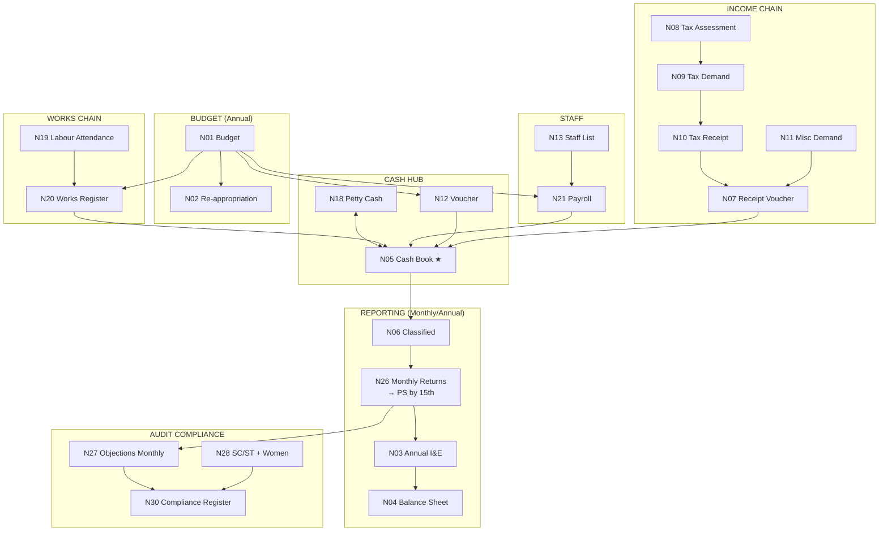

# Maharashtra GP — 33 Namune: Master Map of Content

> **Independent Claude draft** — compare with Cursor draft at `docs/superpowers/specs/2026-04-18-maharashtra-gp-33-namune-machine-requirements.md`
> **Master spec (machine-readable):** `docs/superpowers/specs/2026-04-18-maharashtra-gp-33-namune-claude-draft.md`

---

## All 33 Namune — Quick Reference

| # | Marathi Name | English | Category | Risk | MOC |
|---|-------------|---------|----------|------|-----|
| [[Namuna-01]] | अर्थसंकल्प | Annual Budget Estimate | Budget | HIGH | [[MOC-Budget]] |
| [[Namuna-02]] | पुनर्विनियोजन | Re-appropriation Register | Budget | HIGH | [[MOC-Budget]] |
| [[Namuna-03]] | जमा-खर्च विवरण | Annual I&E Statement | Reporting | HIGH | [[MOC-Reporting]] |
| [[Namuna-04]] | मत्ता व दायित्वे | Assets & Liabilities (BS) | Reporting | MEDIUM | [[MOC-Reporting]] |
| [[Namuna-05]] | सामान्य रोकड वही | General Cash Book (+5क) | Cash | VERY HIGH | [[MOC-Cash]] |
| [[Namuna-06]] | वर्गीकृत जमा नोंदवही | Classified Receipt Register | Receipt | MEDIUM | [[MOC-Receipt]] |
| [[Namuna-07]] | सामान्य पावती | General Receipt Voucher | Receipt | HIGH | [[MOC-Receipt]] |
| [[Namuna-08]] | कर आकारणी नोंदवही | Tax Assessment Register | Tax | HIGH | [[MOC-Tax]] |
| [[Namuna-09]] | कर मागणी नोंदवही | Tax Demand Register (+9क) | Tax | HIGH | [[MOC-Tax]] |
| [[Namuna-10]] | कर व फी बाबत पावती | Tax & Fee Receipt | Tax | HIGH | [[MOC-Tax]] |
| [[Namuna-11]] | किरकोळ मागणी नोंदवही | Miscellaneous Demand Register | Receipt | MEDIUM | [[MOC-Receipt]] |
| [[Namuna-12]] | आकस्मित खर्च प्रमाणक | Contingency Expense Voucher | Expenditure | VERY HIGH | [[MOC-Expenditure]] |
| [[Namuna-13]] | कर्मचारी वर्गाची सुची | Staff List & Pay Scale | Staff | HIGH | [[MOC-Staff]] |
| [[Namuna-14]] | मुद्रांक हिशोब नोंदवही | Stamp Account Register | Staff | MEDIUM | [[MOC-Staff]] |
| [[Namuna-15]] | उपभोग्य वस्तुसाठा | Consumables Store Register | Staff | LOW-MED | [[MOC-Staff]] |
| [[Namuna-16]] | जड वस्तु / जंगम मालमत्ता | Movable Assets Register | Property | HIGH | [[MOC-Property]] |
| [[Namuna-17]] | अग्रीम / अनामत | Advances & Deposits Register | Advances | HIGH | [[MOC-Advances]] |
| [[Namuna-18]] | किरकोळ रोकड वही | Petty Cash Book | Cash | MEDIUM | [[MOC-Cash]] |
| [[Namuna-19]] | हजेरीपट | Labour Attendance Register | Works | VERY HIGH | [[MOC-Works]] |
| [[Namuna-20]] | कामे नोंदवही | Works Register (+20क 20ख 20ख1) | Works | VERY HIGH | [[MOC-Works]] |
| [[Namuna-21]] | कर्मचारी देयक | Employee Payroll Register | Expenditure | VERY HIGH | [[MOC-Expenditure]] |
| [[Namuna-22]] | स्थावर मालमत्ता | Immovable Property Register | Property | HIGH | [[MOC-Property]] |
| [[Namuna-23]] | रस्ते नोंदवही | Roads Register | Property | MEDIUM | [[MOC-Property]] |
| [[Namuna-24]] | जमीन नोंदवही | Land Register | Property | HIGH | [[MOC-Property]] |
| [[Namuna-25]] | गुतवणुक नोंदवही | Investment Register | Advances | MEDIUM | [[MOC-Advances]] |
| [[Namuna-26]] | मासिक विवरण (26क+26ख) | Monthly Returns | Reporting | HIGH | [[MOC-Reporting]] |
| [[Namuna-27]] | लेखापरीक्षण आक्षेप मासिक | Audit Objections Monthly | Reporting | HIGH | [[MOC-Reporting]] |
| [[Namuna-28]] | SC/ST + महिला खर्च | SC/ST 15% + Women 10% | Reporting | VERY HIGH | [[MOC-Reporting]] |
| [[Namuna-29]] | कर्ज नोंदवही | Loan Register | Advances | MEDIUM | [[MOC-Advances]] |
| [[Namuna-30]] | लेखापरीक्षण पूर्तता | Audit Compliance Register | Audit | VERY HIGH | [[MOC-Audit]] |
| [[Namuna-31]] | प्रवास भत्ता देयक | Travel Allowance Register | Expenditure | LOW | [[MOC-Expenditure]] |
| [[Namuna-32]] | परतावा आदेश | Refund Order Register | Expenditure | LOW | [[MOC-Expenditure]] |
| [[Namuna-33]] | वृक्ष नोंदवही | Tree Register | Property | MEDIUM | [[MOC-Property]] |

---

## Group MOC Pages

| Group | Namune | MOC |
|-------|--------|-----|
| Budget & Planning | N1, N2 | [[MOC-Budget]] |
| Daily Cash Chain | N5, N18 | [[MOC-Cash]] |
| Tax Chain | N8, N9, N10 | [[MOC-Tax]] |
| Receipt & Income | N6, N7, N11 | [[MOC-Receipt]] |
| Expenditure & Payments | N12, N21, N31, N32 | [[MOC-Expenditure]] |
| Works & Capital | N19, N20 | [[MOC-Works]] |
| Staff & Stores | N13, N14, N15 | [[MOC-Staff]] |
| Property & Assets | N16, N22, N23, N24, N33 | [[MOC-Property]] |
| Advances, Investments & Loans | N17, N25, N29 | [[MOC-Advances]] |
| Reporting & Annual Accounts | N3, N4, N26, N27, N28 | [[MOC-Reporting]] |
| Audit & Compliance | N30 | [[MOC-Audit]] |

---

## Master Flow Diagram



## Critical Daily Path (in sequence)

```
1. N7   → Issue receipt for any income received
2. N10  → Tax receipt if tax payment received
3. N11  → Misc demand/collection if applicable
4. N12  → Contingency voucher for any payment
5. N18  → Petty cash for small expenses
6. N19  → Labour attendance for active work sites
7. N5क  → Post all transactions to Daily Cash Book (end of day)
8. N5   → Weekly reconciliation from N5क
9. N14  → Stamp register when stamps used
```

**Monthly by 15th:** N26क + N26ख + N27 + N28 → to Panchayat Samiti

---

## High-Risk Registers (VERY HIGH audit risk)

| Namuna | Why It's Very High Risk |
|--------|------------------------|
| [[Namuna-05]] | Primary fraud book — unbalanced books, erasures, missing authentication |
| [[Namuna-12]] | Fake vouchers, payments without bills, cash above limit |
| [[Namuna-19]] | Ghost workers, inflated muster rolls |
| [[Namuna-20]] | Payment without measurement book, inflated quantities |
| [[Namuna-21]] | Ghost employees, salary without signatures |
| [[Namuna-28]] | SC/ST 15% and women 10% targets unmet |
| [[Namuna-30]] | False compliance entries, long-pending objections |

---

## Cross-AI Reconciliation Status

| Item | Claude (this draft) | Cursor Draft | Gemini Draft | Reconciled |
|------|--------------------|--------------|----|-----------|
| Complete N1–N33 list | ✅ | ✅ | ⬜ | ⬜ |
| Marathi names | ✅ | ✅ | ⬜ | ⬜ |
| Legal refs (MVP Act sections) | Partial [VERIFY] | Partial [VERIFY] | ⬜ | ⬜ |
| Lekha Sanhita rule numbers | All [VERIFY] | All [VERIFY] | ⬜ | ⬜ |
| Dependency graph | ✅ | ✅ | ⬜ | ⬜ |
| Fields per register | ✅ | Partial | ⬜ | ⬜ |
| Validation rules | ✅ | Partial | ⬜ | ⬜ |
| Audit risk flags | ✅ | ✅ | ⬜ | ⬜ |

---

## Open VERIFY Items (priority list for human expert review)

1. **MVP Act section numbers** for budget (§61 or §62?), accounts (§63?), audit (§64?), rules power (§65?)
2. **Lekha Sanhita 2011 specific rule numbers** for every chapter — consult the printed code
3. **Submission deadlines** — N1 (January 31 vs. December discrepancy); N26 (15th confirmed but verify district circular)
4. **Thresholds**: cheque limit (₹2,000?), revenue stamp threshold (₹5,000?), petty cash limit (₹500?), cash deposit within 24 hours rule
5. **Tax demand notice (9क)** — whether it is a separate annex serial or sub-form of N9 in your district's printed set
6. **N28** — specific GR number mandating 15% SC/ST and 10% women earmark
7. **Works thresholds** — GP-level technical sanction limit and tender threshold

---

## Dataview: All Namune by Risk Level
```dataview
TABLE namuna, name_mr, category, frequency, audit_risk
FROM "Namune"
WHERE namuna > 0
SORT audit_risk DESC, namuna ASC
```
