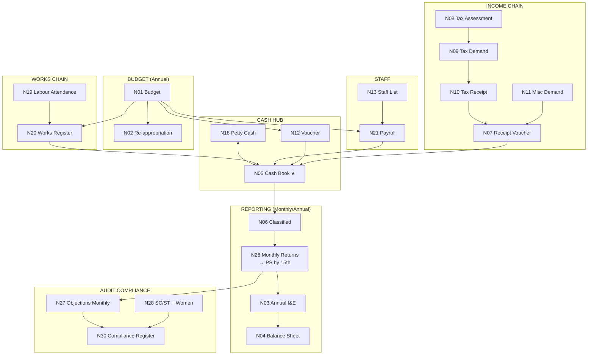

# Master flow diagram

Full dependency overview for the Gram Panchayat register chain. **Navigation:** [[MOC-Master]].

```mermaid
flowchart TD
    subgraph Budget["BUDGET (Annual)"]
        N01[N01 Budget] --> N02[N02 Re-appropriation]
    end
    subgraph Income["INCOME CHAIN"]
        N08[N08 Tax Assessment] --> N09[N09 Tax Demand]
        N09 --> N10[N10 Tax Receipt]
        N11[N11 Misc Demand] --> N07[N07 Receipt Voucher]
        N10 --> N07
    end
    subgraph Works["WORKS CHAIN"]
        N19[N19 Labour Attendance] --> N20[N20 Works Register]
    end
    subgraph Staff["STAFF"]
        N13[N13 Staff List] --> N21[N21 Payroll]
    end
    subgraph Cash["CASH HUB"]
        N07 --> N05[N05 Cash Book ★]
        N12[N12 Voucher] --> N05
        N21 --> N05
        N20 --> N05
        N18[N18 Petty Cash] <--> N05
    end
    subgraph Reporting["REPORTING (Monthly/Annual)"]
        N05 --> N06[N06 Classified]
        N06 --> N26[N26 Monthly Returns\n→ PS by 15th]
        N26 --> N03[N03 Annual I&E]
        N03 --> N04[N04 Balance Sheet]
    end
    subgraph Audit["AUDIT COMPLIANCE"]
        N26 --> N27[N27 Objections Monthly]
        N28[N28 SC/ST + Women] --> N30[N30 Compliance Register]
        N27 --> N30
    end
    N01 --> N12
    N01 --> N21
    N01 --> N20
```
