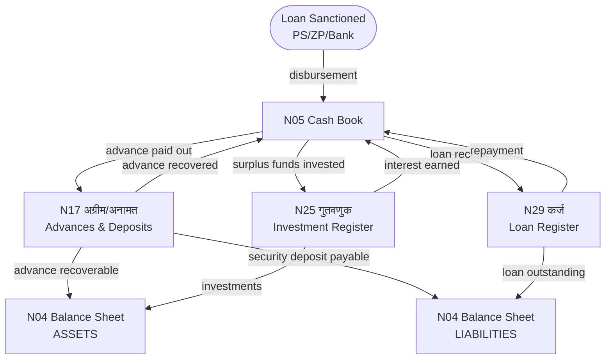

# Advances, investments and loans flow

**Navigation:** [[MOC-Advances]]

```mermaid
flowchart TD
    N05[N05 Cash Book] -->|advance paid out| N17[N17 अग्रीम/अनामत\nAdvances & Deposits]
    N05 -->|surplus funds invested| N25[N25 गुतवणुक\nInvestment Register]
    LoanSanction([Loan Sanctioned\nPS/ZP/Bank]) -->|disbursement| N05
    N05 -->|loan receipt| N29[N29 कर्ज\nLoan Register]
    N17 -->|advance recoverable| N04_A[N04 Balance Sheet\nASSETS]
    N17 -->|security deposit payable| N04_L[N04 Balance Sheet\nLIABILITIES]
    N25 -->|investments| N04_A
    N29 -->|loan outstanding| N04_L
    N25 -->|interest earned| N05
    N29 -->|repayment| N05
    N17 -->|advance recovered| N05
```
