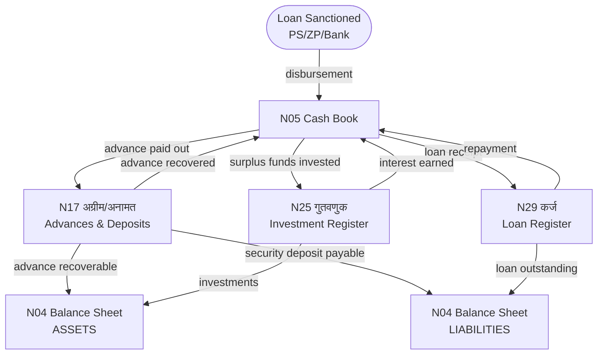

# MOC — Advances, Investments & Loans

## Overview
Three registers track the GP's financial commitments beyond day-to-day operations: temporary advances (N17), investments of surplus funds (N25), and long-term borrowings (N29). All three have balance sheet implications — they appear as assets or liabilities in N4.

## Namune in This Group

| Namuna | Name (MR) | English | Frequency | Audit Risk |
|--------|-----------|---------|-----------|------------|
| [[Namuna-17]] | अग्रीम / अनामत | Advances & Deposits Register | As needed | HIGH |
| [[Namuna-25]] | गुतवणुक नोंदवही | Investment Register | As needed | MEDIUM |
| [[Namuna-29]] | कर्ज नोंदवही | Loan Register | As needed | MEDIUM |

## Flow Diagram



## Balance Sheet Connections
```
N17 (Advances paid out) ──→ N4 (ASSETS: Advances recoverable)
N17 (Deposits received) ──→ N4 (LIABILITIES: Security deposits payable)
N25 (Investments) ────────→ N4 (ASSETS: Investments)
N29 (Loans) ──────────────→ N4 (LIABILITIES: Loans outstanding)
```

## Key Rules
- Advances (N17): Must be adjusted within prescribed period — long overdue advances are HIGH audit risk
- Investments (N25): Only in permitted instruments (nationalised banks, post offices, govt bonds)
- Loans (N29): Require GP resolution — unauthorised borrowings are major objections

## Dataview Query
```dataview
TABLE name_mr, frequency, audit_risk, who_approves
FROM "Namune/Advances"
WHERE namuna > 0
SORT namuna ASC
```
