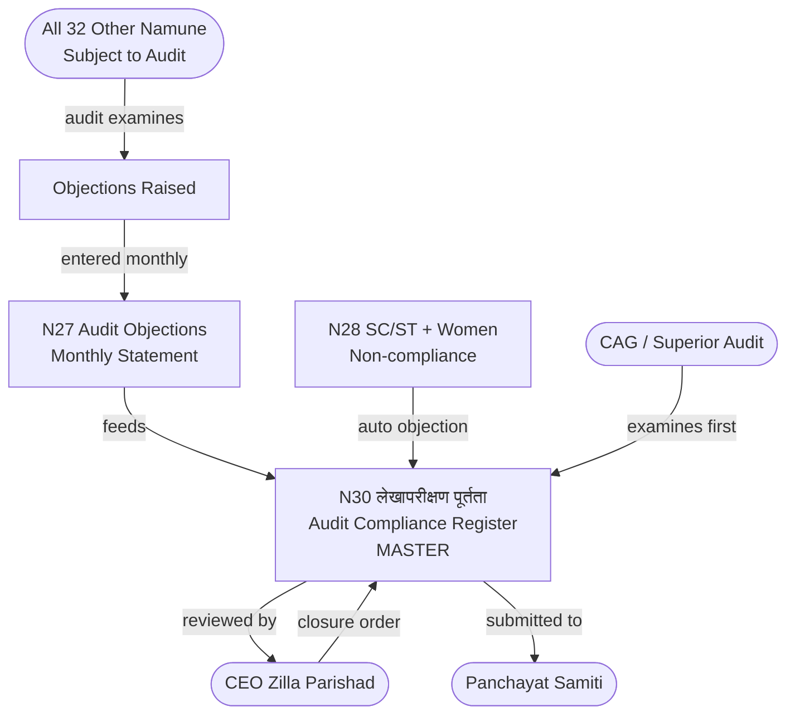

# Audit compliance flow

**Navigation:** [[MOC-Audit]]

```mermaid
flowchart TD
    AllNamune([All 32 Other Namune\nSubject to Audit]) -->|audit examines| Objections[Objections Raised]
    Objections -->|entered monthly| N27[N27 Audit Objections\nMonthly Statement]
    N27 -->|feeds| N30[N30 लेखापरीक्षण पूर्तता\nAudit Compliance Register\nMASTER]
    N28[N28 SC/ST + Women\nNon-compliance] -->|auto objection| N30
    N30 -->|reviewed by| CEOZP([CEO Zilla Parishad])
    CEOZP -->|closure order| N30
    N30 -->|submitted to| PS([Panchayat Samiti])
    AuditInspection([CAG / Superior Audit]) -->|examines first| N30
```
