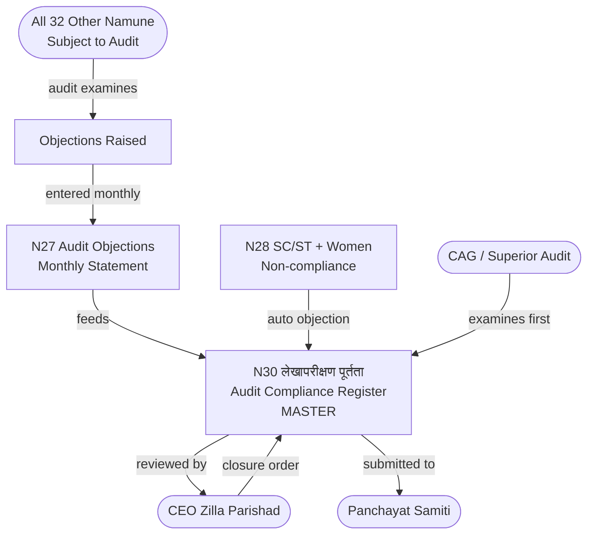

# MOC — Audit & Compliance

## Overview
Namuna 30 is the master audit compliance register — the cumulative record of every audit objection across all years. While N27 (in the Reporting group) tracks objections monthly, N30 is the all-time register that auditors examine first in any inspection. It is the final accountability document in the GP accounting chain.

## Namune in This Group

| Namuna | Name (MR) | English | Frequency | Audit Risk |
|--------|-----------|---------|-----------|------------|
| [[Namuna-30]] | लेखापरीक्षण पूर्तता नोंदवही | Audit Compliance Register | Ongoing | VERY HIGH |

## Flow Diagram



## Position in Audit Chain
```
All 32 other Namune ──audit examines──→ Objections raised
    ↓
N27 (Reporting group — monthly objection tracking)
    ↓
N30 (MASTER cumulative compliance register)
    ↓ Compliance completed
CEO ZP closure order
```

## Connections To All Groups
N30 is fed by (and reconciles against) virtually every other Namuna:
- [[Namuna-03]] [[Namuna-04]] (Annual accounts — basis for annual audit)
- [[Namuna-27]] (Monthly objections feed cumulative N30)
- [[Namuna-28]] (Welfare compliance — frequently flagged)
- All cash, tax, works, payroll registers (direct audit subjects)

## Key Rule
N30 is the **first document examined** in any superior audit or CAG inspection.
Its incompleteness or falsification is itself a serious audit finding.

## Dataview Query
```dataview
TABLE name_mr, frequency, audit_risk, submitted_to
FROM "Namune/Audit"
WHERE namuna > 0
SORT namuna ASC
```
