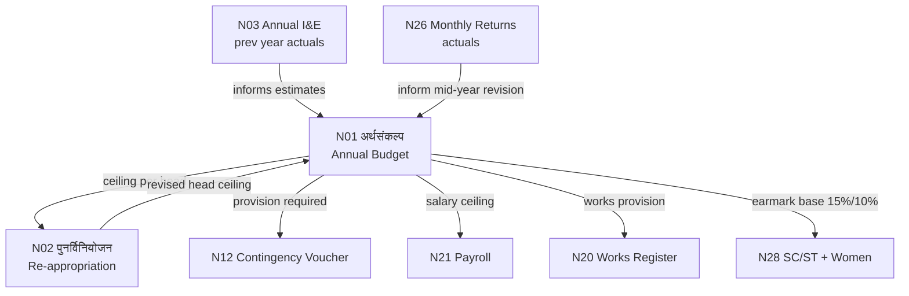

# Budget chain flow

**Navigation:** [[MOC-Budget]]

```mermaid
flowchart TD
    N03[N03 Annual I&E\nprev year actuals] -->|informs estimates| N01[N01 अर्थसंकल्प\nAnnual Budget]
    N26[N26 Monthly Returns\nactuals] -->|inform mid-year revision| N01
    N01 -->|ceiling per head| N02[N02 पुनर्विनियोजन\nRe-appropriation]
    N02 -->|revised head ceiling| N01
    N01 -->|provision required| N12[N12 Contingency Voucher]
    N01 -->|salary ceiling| N21[N21 Payroll]
    N01 -->|works provision| N20[N20 Works Register]
    N01 -->|earmark base 15%/10%| N28[N28 SC/ST + Women]
```
