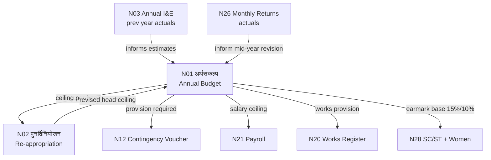

# MOC — Budget & Planning

## Overview
The two budget registers are the **starting point of the entire GP financial system**. Every rupee spent by the GP must trace back to a provision in Namuna 1. Namuna 2 handles mid-year adjustments.

## Namune in This Group

| Namuna | Name (MR) | English | Frequency | Audit Risk |
|--------|-----------|---------|-----------|------------|
| [[Namuna-01]] | अर्थसंकल्प | Annual Budget Estimate | Annual | HIGH |
| [[Namuna-02]] | पुनर्विनियोजन | Re-appropriation Register | As needed | HIGH |

## Flow Diagram



## Internal Dependencies
```
N1 (Budget) ←── N2 (Re-appropriation modifies N1)
```

## Feeds Into (Other Groups)
- [[Namuna-12]] (Expenditure — contingency needs N1 provision)
- [[Namuna-20]] (Works — works need N1 provision)
- [[Namuna-28]] (Reporting — welfare % calculated from N1)
- [[Namuna-26]] (Reporting — monthly returns reference N1 budget heads)
- [[Namuna-03]] (Reporting — N2 revised amounts in annual statement)

## Key Rules
- No expenditure in any register without a corresponding budget head in N1
- N2 requires formal GP resolution and (above threshold) PS sanction
- N1 must go to Gram Sabha BEFORE submission to Panchayat Samiti

## Dataview Query
```dataview
TABLE name_mr, frequency, audit_risk, who_approves
FROM "Namune/Budget"
WHERE namuna > 0
SORT namuna ASC
```
