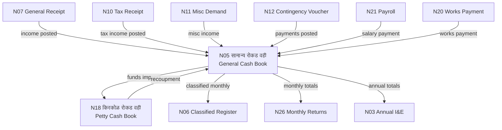

# Daily cash chain flow

**Navigation:** [[MOC-Cash]]

```mermaid
flowchart TD
    N07[N07 General Receipt] -->|income posted| N05[N05 सामान्य रोकड वही\nGeneral Cash Book]
    N10[N10 Tax Receipt] -->|tax income posted| N05
    N11[N11 Misc Demand] -->|misc income| N05
    N12[N12 Contingency Voucher] -->|payments posted| N05
    N21[N21 Payroll] -->|salary payment| N05
    N20[N20 Works Payment] -->|works payment| N05
    N05 -->|funds imprest| N18[N18 किरकोळ रोकड वही\nPetty Cash Book]
    N18 -->|recoupment| N05
    N05 -->|classified monthly| N06[N06 Classified Register]
    N05 -->|monthly totals| N26[N26 Monthly Returns]
    N05 -->|annual totals| N03[N03 Annual I&E]
```
