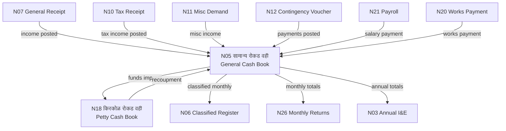

# MOC — Daily Cash Chain

## Overview
The cash registers are the **heartbeat of GP accounting**. Every financial transaction flows through Namuna 5 (General Cash Book). Sub-form 5क captures daily entries; N18 handles small petty expenses. These are updated every single working day.

## Namune in This Group

| Namuna | Name (MR) | English | Frequency | Audit Risk |
|--------|-----------|---------|-----------|------------|
| [[Namuna-05]] | सामान्य रोकड वही (+ 5क) | General Cash Book + Daily | Daily | VERY HIGH |
| [[Namuna-18]] | किरकोळ रोकड वही | Petty Cash Book | Daily | MEDIUM |

## Flow Diagram



## Internal Dependencies
```
N18 (Petty Cash — imprest from N5) ──→ N5 (replenishment posts back)
N5क (Daily Cash Book) ──→ N5 (weekly roll-up)
```

## Receives From (Other Groups)
- [[Namuna-07]] [[Namuna-10]] [[Namuna-11]] (Receipt group — all income)
- [[Namuna-12]] [[Namuna-21]] [[Namuna-31]] (Expenditure group — all payments)
- [[Namuna-20]] (Works — works payments)
- [[Namuna-25]] [[Namuna-29]] (Advances — investment/loan flows)

## Feeds Into (Other Groups)
- [[Namuna-06]] (Receipt — classified ledger posted from N5)
- [[Namuna-26]] (Reporting — monthly totals)
- [[Namuna-03]] (Reporting — annual totals)

## Critical Daily Rule
Cash book MUST be balanced every day. Sarpanch MUST authenticate weekly.
Unbalanced cash book = automatic major audit objection.

## Dataview Query
```dataview
TABLE name_mr, frequency, audit_risk, who_approves
FROM "Namune/Cash"
WHERE namuna > 0
SORT namuna ASC
```
