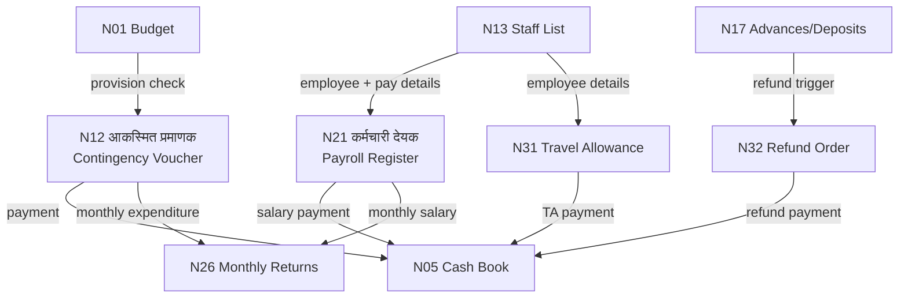

# Expenditure and payments flow

**Navigation:** [[MOC-Expenditure]]

```mermaid
flowchart TD
    N01[N01 Budget] -->|provision check| N12[N12 आकस्मित प्रमाणक\nContingency Voucher]
    N13[N13 Staff List] -->|employee + pay details| N21[N21 कर्मचारी देयक\nPayroll Register]
    N13 -->|employee details| N31[N31 Travel Allowance]
    N17[N17 Advances/Deposits] -->|refund trigger| N32[N32 Refund Order]
    N12 -->|payment| N05[N05 Cash Book]
    N21 -->|salary payment| N05
    N31 -->|TA payment| N05
    N32 -->|refund payment| N05
    N12 -->|monthly expenditure| N26[N26 Monthly Returns]
    N21 -->|monthly salary| N26
```
