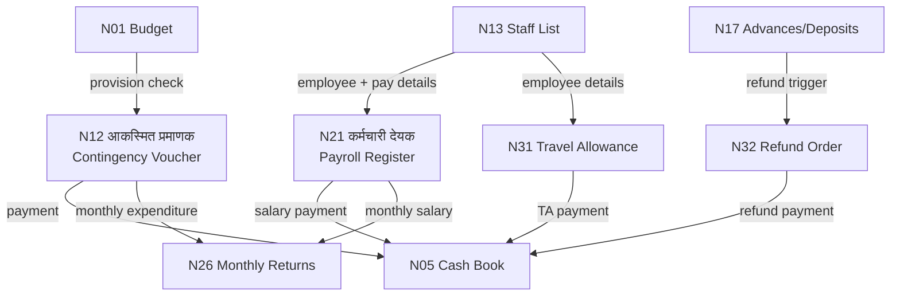

# MOC — Expenditure & Payments

## Overview
These four registers authorise and record all GP payments except works bills (N20). Namuna 12 is the most audited register — it is the gateway for all contingency payments. N21 is the payroll. N31 and N32 handle TA and refunds.

## Namune in This Group

| Namuna | Name (MR) | English | Frequency | Audit Risk |
|--------|-----------|---------|-----------|------------|
| [[Namuna-12]] | आकस्मित खर्च प्रमाणक | Contingency Expense Voucher | As needed | VERY HIGH |
| [[Namuna-21]] | कर्मचारी देयक | Employee Payroll Register | Monthly | VERY HIGH |
| [[Namuna-31]] | प्रवास भत्ता देयक | Travel Allowance Register | As needed | LOW |
| [[Namuna-32]] | परतावा आदेश | Refund Order Register | As needed | LOW |

## Flow Diagram



## Flow
```
N1 (Budget provision) ──→ N12 (contingency voucher) ──→ N5 (cash book)
N13 (Staff details) ────→ N21 (payroll) ──────────────→ N5
N13 ────────────────────→ N31 (travel) ────────────────→ N5
N17 (advance recovered)→ N32 (refund order) ──────────→ N5
```

## Key Rule
Every payment from N5 must have an authorised voucher from this group (or N20).
Cash payments above ₹2,000 are objected to [VERIFY: current threshold].

## Dataview Query
```dataview
TABLE name_mr, frequency, audit_risk, who_approves
FROM "Namune/Expenditure"
WHERE namuna > 0
SORT namuna ASC
```
