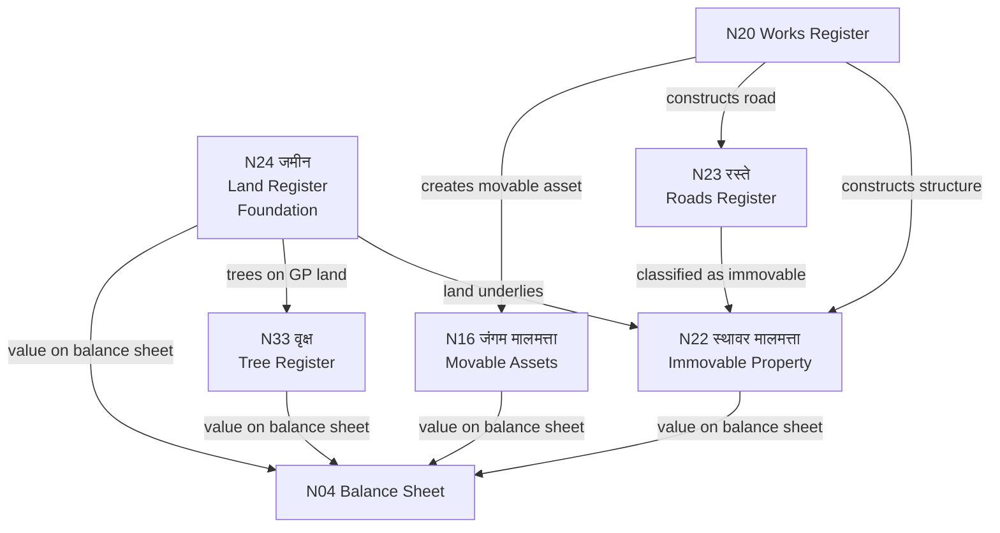

# MOC — Property & Assets

## Overview
Five registers collectively document all GP physical assets. Land (N24) is foundational — structures (N22) and trees (N33) sit on GP land. Roads (N23) feed into immovable property (N22). Movable assets (N16) covers equipment and furniture. All five feed into the balance sheet (N4).

## Namune in This Group

| Namuna | Name (MR) | English | Frequency | Audit Risk |
|--------|-----------|---------|-----------|------------|
| [[Namuna-16]] | जंगम मालमत्ता | Fixed & Movable Assets | Annual verification | HIGH |
| [[Namuna-22]] | स्थावर मालमत्ता | Immovable Property Register | Annual verification | HIGH |
| [[Namuna-23]] | रस्ते नोंदवही | Roads Register | On construction/maintenance | MEDIUM |
| [[Namuna-24]] | जमीन नोंदवही | Land Register | On acquisition/change | HIGH |
| [[Namuna-33]] | वृक्ष नोंदवही | Tree Register | Annual census | MEDIUM |

## Flow Diagram



## Hierarchy
```
N24 (Land) ──foundation for──→ N22 (Immovable Property)
                               N33 (Trees on GP land)
N23 (Roads) ──classified as──→ N22 (Immovable)
N20 (Works) ──creates assets─→ N16 (Movable) + N22 + N23
All five ───────────────────→ N4 (Balance Sheet)
```

## Key Rule
Annual physical verification of all five registers is mandatory.
Gap of 2+ years = automatic audit objection.

## Dataview Query
```dataview
TABLE name_mr, frequency, audit_risk, who_approves
FROM "Namune/Property"
WHERE namuna > 0
SORT namuna ASC
```
