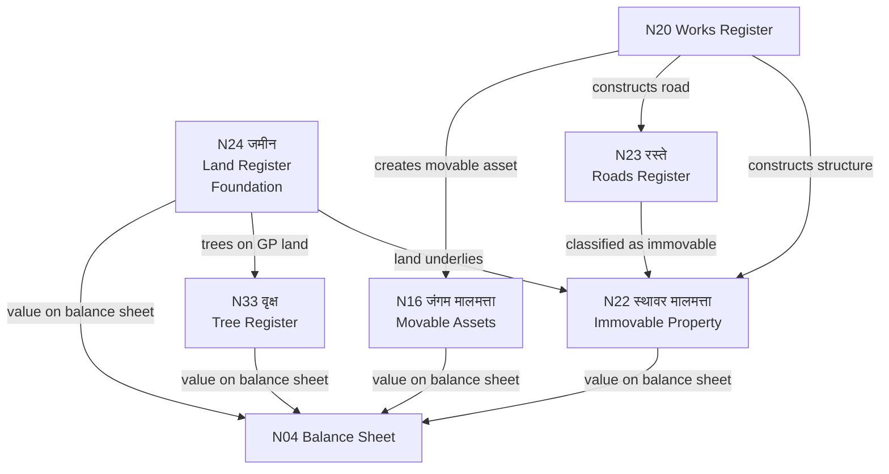

# Property and assets flow

**Navigation:** [[MOC-Property]]

```mermaid
flowchart TD
    N24[N24 जमीन\nLand Register\nFoundation] -->|land underlies| N22[N22 स्थावर मालमत्ता\nImmovable Property]
    N24 -->|trees on GP land| N33[N33 वृक्ष\nTree Register]
    N20[N20 Works Register] -->|constructs structure| N22
    N20 -->|constructs road| N23[N23 रस्ते\nRoads Register]
    N20 -->|creates movable asset| N16[N16 जंगम मालमत्ता\nMovable Assets]
    N23 -->|classified as immovable| N22
    N22 -->|value on balance sheet| N04[N04 Balance Sheet]
    N16 -->|value on balance sheet| N04
    N24 -->|value on balance sheet| N04
    N33 -->|value on balance sheet| N04
```
