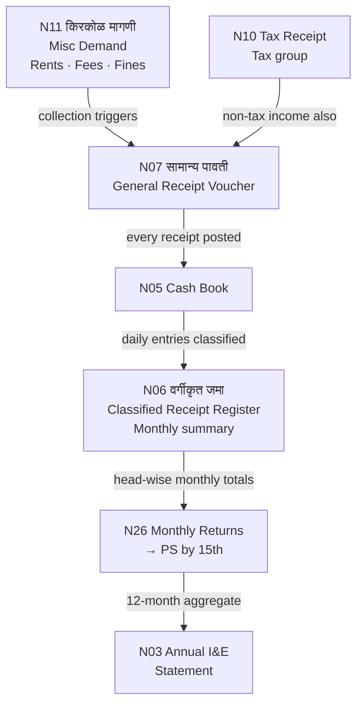

# Receipt and income flow

**Navigation:** [[MOC-Receipt]]

```mermaid
flowchart TD
    N11[N11 किरकोळ मागणी\nMisc Demand\nRents · Fees · Fines] -->|collection triggers| N07[N07 सामान्य पावती\nGeneral Receipt Voucher]
    N10[N10 Tax Receipt\nTax group] -->|non-tax income also| N07
    N07 -->|every receipt posted| N05[N05 Cash Book]
    N05 -->|daily entries classified| N06[N06 वर्गीकृत जमा\nClassified Receipt Register\nMonthly summary]
    N06 -->|head-wise monthly totals| N26[N26 Monthly Returns\n→ PS by 15th]
    N26 -->|12-month aggregate| N03[N03 Annual I&E\nStatement]
```
