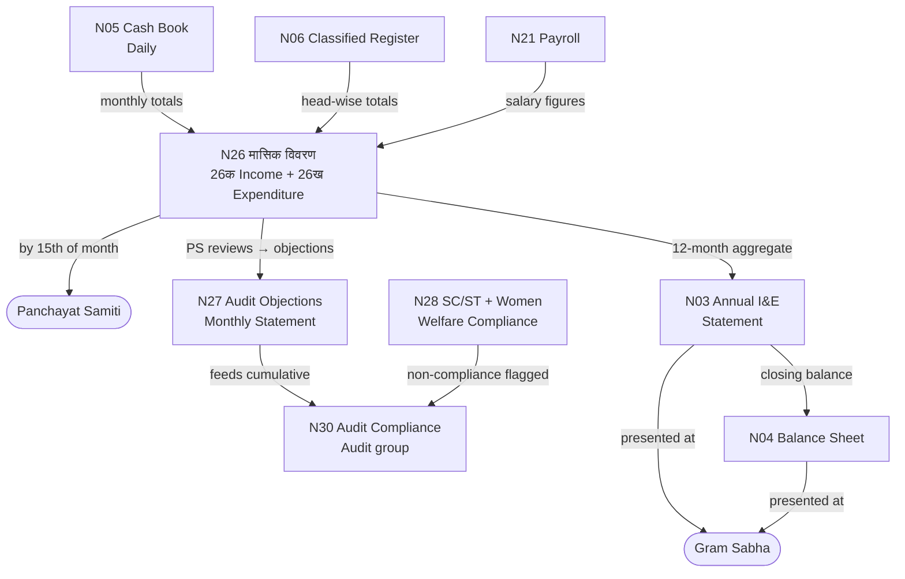

# MOC — Reporting & Annual Accounts

## Overview
These five registers are the GP's **accountability output layer** — they summarise and report the financial activity recorded in all other registers. N26 is the monthly pulse; N3 and N4 are the annual financial statements; N27 and N28 are compliance monitoring registers.

## Namune in This Group

| Namuna | Name (MR) | English | Frequency | Audit Risk |
|--------|-----------|---------|-----------|------------|
| [[Namuna-03]] | जमा-खर्च विवरण | Annual Income & Expenditure Statement | Annual | HIGH |
| [[Namuna-04]] | मत्ता व दायित्वे | Assets & Liabilities (Balance Sheet) | Annual | MEDIUM |
| [[Namuna-26]] | मासिक विवरण (26क + 26ख) | Monthly Returns (Income + Expenditure) | Monthly | HIGH |
| [[Namuna-27]] | लेखापरीक्षण आक्षेप मासिक | Audit Objections Monthly Statement | Monthly | HIGH |
| [[Namuna-28]] | SC/ST + महिला खर्च विवरण | SC/ST 15% + Women 10% Welfare Register | Monthly/Quarterly | VERY HIGH |

## Flow Diagram



## Reporting Hierarchy
```
Daily: N5 (Cash Book) + N6 (Classified)
    ↓ Monthly aggregation
N26क (Income Return) + N26ख (Expenditure Return) — by 15th to PS
    ↓ Annual aggregation
N3 (Annual I&E Statement) + N4 (Balance Sheet) — at Gram Sabha

Audit chain:
N26 ──triggers──→ N27 (Audit Objections Monthly) ──→ N30 (Cumulative Compliance)
N28 (Welfare compliance) ──→ N30 (Audit)
```

## Key Deadlines
- N26: 15th of following month to Panchayat Samiti [VERIFY]
- N3 + N4: Annual Gram Sabha (April–June) [VERIFY]

## Dataview Query
```dataview
TABLE name_mr, frequency, audit_risk, submitted_to
FROM "Namune/Reporting"
WHERE namuna > 0
SORT namuna ASC
```
