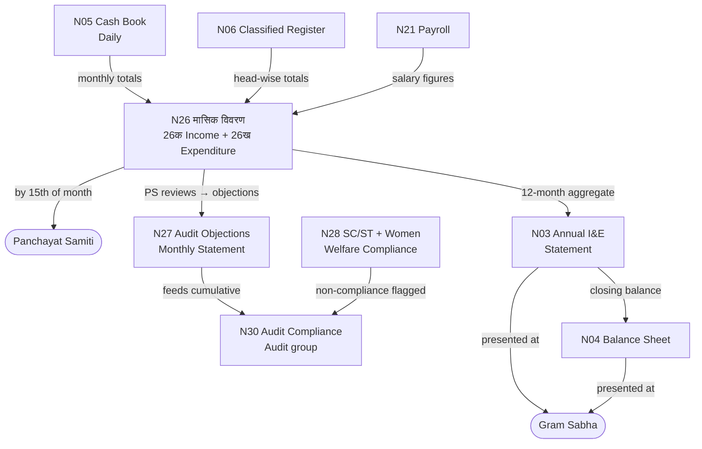

# Reporting and annual accounts flow

**Navigation:** [[MOC-Reporting]]

```mermaid
flowchart TD
    N05[N05 Cash Book\nDaily] -->|monthly totals| N26[N26 मासिक विवरण\n26क Income + 26ख Expenditure]
    N06[N06 Classified Register] -->|head-wise totals| N26
    N21[N21 Payroll] -->|salary figures| N26
    N26 -->|by 15th of month| PS([Panchayat Samiti])
    N26 -->|PS reviews → objections| N27[N27 Audit Objections\nMonthly Statement]
    N27 -->|feeds cumulative| N30[N30 Audit Compliance\nAudit group]
    N28[N28 SC/ST + Women\nWelfare Compliance] -->|non-compliance flagged| N30
    N26 -->|12-month aggregate| N03[N03 Annual I&E\nStatement]
    N03 -->|presented at| GS([Gram Sabha])
    N03 -->|closing balance| N04[N04 Balance Sheet]
    N04 -->|presented at| GS
```
