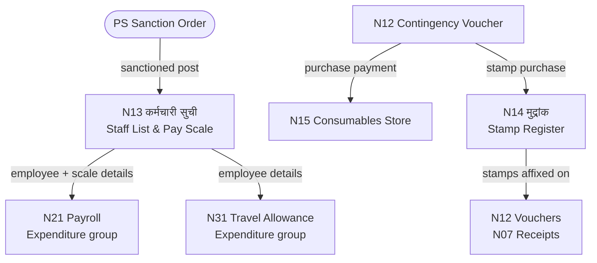

# MOC — Staff & Stores

## Overview
Staff registers track the GP's human resources and office supplies. N13 is the master employee register — the foundation for payroll (N21) and TA (N31) in the Expenditure group. N14 and N15 track stamps and consumables as quasi-financial items.

## Namune in This Group

| Namuna | Name (MR) | English | Frequency | Audit Risk |
|--------|-----------|---------|-----------|------------|
| [[Namuna-13]] | कर्मचारी वर्गाची सुची | Staff List & Pay Scale Register | As needed (updates) | HIGH |
| [[Namuna-14]] | मुद्रांक हिशोब नोंदवही | Stamp Account Register | As needed | MEDIUM |
| [[Namuna-15]] | उपभोग्य वस्तुसाठा | Consumables Store Register | As needed | LOW-MEDIUM |

## Flow Diagram



## Flows
```
N13 ──→ N21 (Payroll — Expenditure group)
N13 ──→ N31 (Travel Allowance — Expenditure group)
N12 ──→ N15 (Consumables purchased via contingency voucher)
N14 (Stamps used on N12 vouchers and N7 receipts)
```

## Key Rule
No salary in N21 to anyone not listed in N13 with a PS-sanctioned post.

## Dataview Query
```dataview
TABLE name_mr, frequency, audit_risk, who_approves
FROM "Namune/Staff"
WHERE namuna > 0
SORT namuna ASC
```
