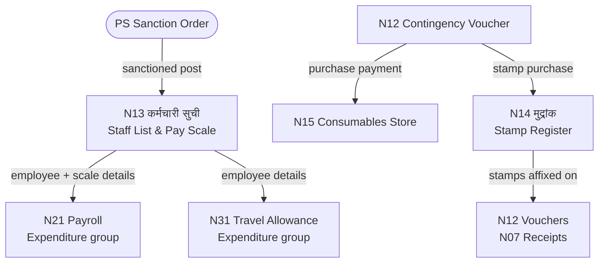

# Staff and stores flow

**Navigation:** [[MOC-Staff]]

```mermaid
flowchart TD
    PSOrder([PS Sanction Order]) -->|sanctioned post| N13[N13 कर्मचारी सुची\nStaff List & Pay Scale]
    N13 -->|employee + scale details| N21[N21 Payroll\nExpenditure group]
    N13 -->|employee details| N31[N31 Travel Allowance\nExpenditure group]
    N12[N12 Contingency Voucher] -->|purchase payment| N15[N15 Consumables Store]
    N12 -->|stamp purchase| N14[N14 मुद्रांक\nStamp Register]
    N14 -->|stamps affixed on| N12_use[N12 Vouchers\nN07 Receipts]
```
