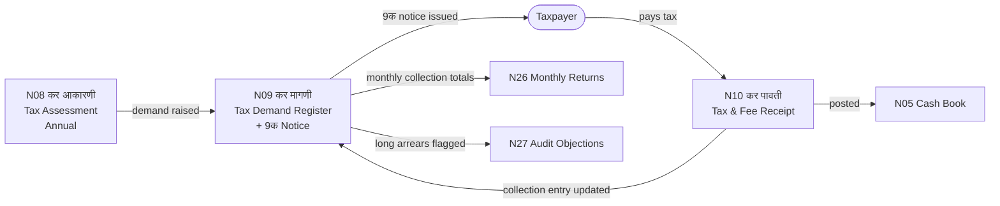

# MOC — Tax Chain (Assess → Demand → Collect)

## Overview
The tax chain is the GP's primary own-revenue system. It flows in a strict three-step sequence: **assess properties → raise demand → collect taxes**. Breaking any link in this chain makes tax recovery legally impossible.

## Namune in This Group

| Namuna | Name (MR) | English | Frequency | Audit Risk |
|--------|-----------|---------|-----------|------------|
| [[Namuna-08]] | कर आकारणी नोंदवही | Tax Assessment Register | Annual | HIGH |
| [[Namuna-09]] | कर मागणी नोंदवही (+ 9क) | Tax Demand Register + Notice | Annual | HIGH |
| [[Namuna-10]] | कर व फी बाबत पावती | Tax & Fee Receipt | As needed | HIGH |

## Flow Diagram



## Chain Flow
```
N8 (Assessment) ──TRIGGERS──→ N9 (Demand raised)
N9 ──TRIGGERS──→ 9क (Demand notice issued to taxpayer)
Taxpayer pays ──→ N10 (Collection receipt issued)
N10 ──RECONCILES──→ N9 (outstanding updated)
N10 ──FEEDS──→ N7 (general receipt) ──→ N5 (cash book)
```

## Key Rule
Demand notice (9क) MUST be issued before any recovery proceedings under MVP Act §129.
Without 9क, the GP cannot legally recover outstanding taxes.

## Dataview Query
```dataview
TABLE name_mr, frequency, audit_risk, who_approves
FROM "Namune/Tax"
WHERE namuna > 0
SORT namuna ASC
```
