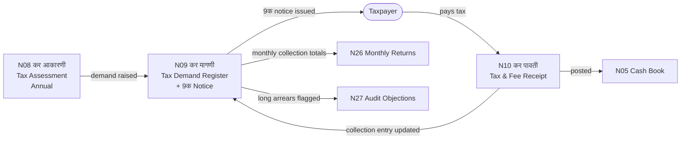

# Tax chain flow

**Navigation:** [[MOC-Tax]]

```mermaid
flowchart LR
    N08[N08 कर आकारणी\nTax Assessment\nAnnual] -->|demand raised| N09[N09 कर मागणी\nTax Demand Register\n+ 9क Notice]
    N09 -->|9क notice issued| Taxpayer([Taxpayer])
    Taxpayer -->|pays tax| N10[N10 कर पावती\nTax & Fee Receipt]
    N10 -->|collection entry updated| N09
    N10 -->|posted| N05[N05 Cash Book]
    N09 -->|monthly collection totals| N26[N26 Monthly Returns]
    N09 -->|long arrears flagged| N27[N27 Audit Objections]
```
