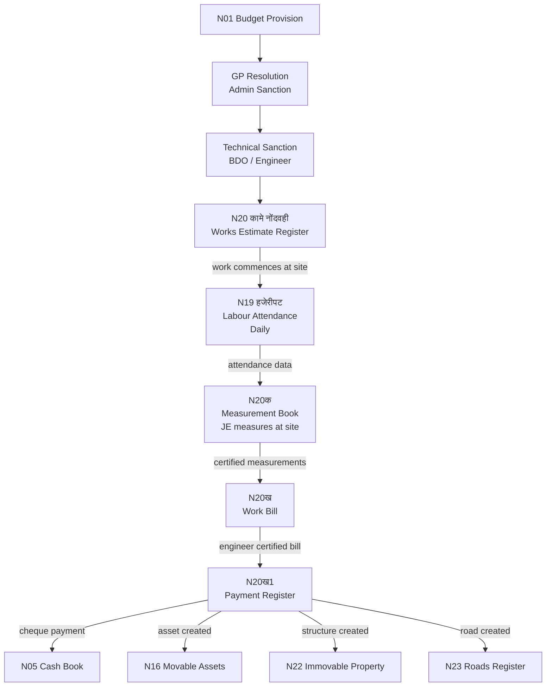

# MOC — Works & Capital

## Overview
Works registers govern all GP infrastructure spending — the single highest-value category of expenditure and the highest fraud risk area. Namuna 20 is a four-part chain (estimate → measurement → bill → payment). Namuna 19 is the daily attendance record that feeds measurement and billing.

## Namune in This Group

| Namuna | Name (MR) | English | Frequency | Audit Risk |
|--------|-----------|---------|-----------|------------|
| [[Namuna-19]] | हजेरीपट | Labour Attendance Register | Daily | VERY HIGH |
| [[Namuna-20]] | कामे नोंदवही (20, 20क, 20ख, 20ख1) | Works Estimate + MB + Bill + Payment | Per work | VERY HIGH |

## Flow Diagram



## Works Chain
```
N1 (Budget provision)
    ↓ GP Resolution (Admin Sanction)
N20 (Works Estimate sanctioned)
    ↓ Work commences
N19 (Daily Labour Attendance)
    ↓ Measurements taken
N20क (Measurement Book) ← feeds from N19
    ↓ Bill prepared
N20ख (Work Bill) — Engineer certifies
    ↓ Payment authorised
N20ख(1) (Payment Register) → N5 (Cash Book)
    ↓ Asset created
N16 (Movable Assets) / N22/N23 (Immovable / Roads)
```

## Critical Rules
- Technical sanction MUST precede work start
- Measurement book entry MUST precede payment
- Works above threshold must be tendered [VERIFY: GP-level limit]

## Dataview Query
```dataview
TABLE name_mr, frequency, audit_risk, who_approves
FROM "Namune/Works"
WHERE namuna > 0
SORT namuna ASC
```
