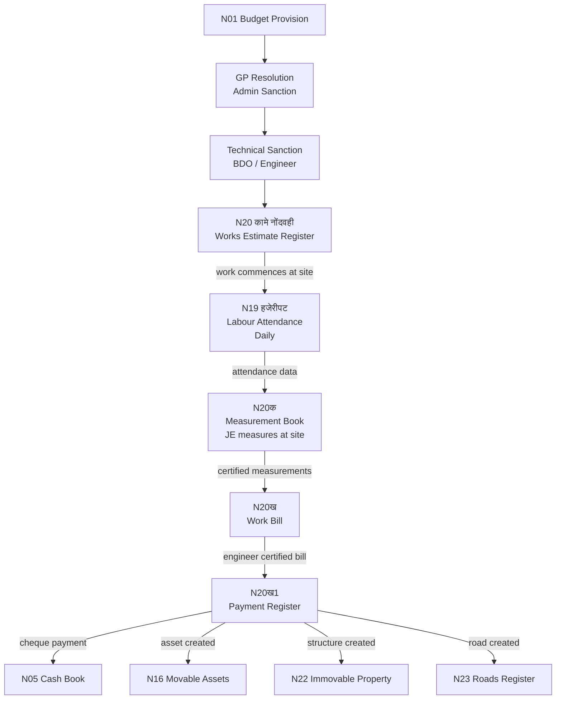

# Works and capital flow

**Navigation:** [[MOC-Works]]

```mermaid
flowchart TD
    N01[N01 Budget Provision] --> GpRes[GP Resolution\nAdmin Sanction]
    GpRes --> TechSanc[Technical Sanction\nBDO / Engineer]
    TechSanc --> N20[N20 कामे नोंदवही\nWorks Estimate Register]
    N20 -->|work commences at site| N19[N19 हजेरीपट\nLabour Attendance\nDaily]
    N19 -->|attendance data| N20MB[N20क\nMeasurement Book\nJE measures at site]
    N20MB -->|certified measurements| N20Bill[N20ख\nWork Bill]
    N20Bill -->|engineer certified bill| N20Pay[N20ख1\nPayment Register]
    N20Pay -->|cheque payment| N05[N05 Cash Book]
    N20Pay -->|asset created| N16[N16 Movable Assets]
    N20Pay -->|structure created| N22[N22 Immovable Property]
    N20Pay -->|road created| N23[N23 Roads Register]
```
